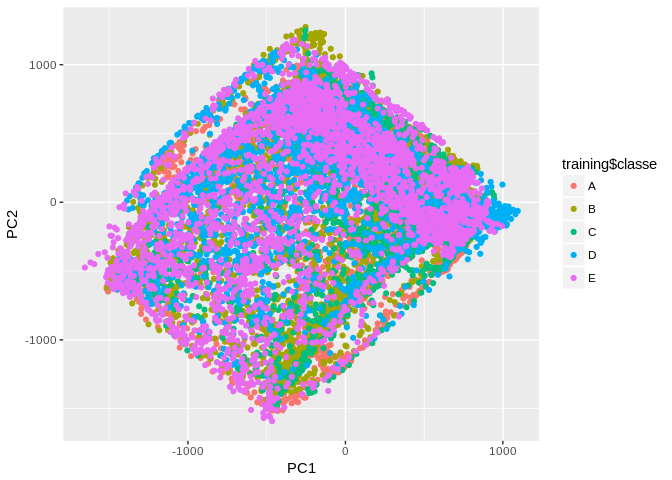

## Executive summary
In this report we build a machine learning model to predict the manner in which the [weight lifting exercise](http://web.archive.org/web/20161224072740/http:/groupware.les.inf.puc-rio.br/har) has been performed. We use state vector machine and random forest models to choose the most accurate method on the cross validation sample. We are able to build an "optimal" model where we expect no out of sample error. 

## Download and cleaning the dataset

First we will download the dataset from the webpage. We use the dataset on "Qualitative Activity Recognition of Weight Lifting Exercises" provided by [Groupware](http://web.archive.org/web/20161224072740/http:/groupware.les.inf.puc-rio.br/har).


```r
## Load required libraries
suppressWarnings(suppressMessages(library(e1071)))
suppressWarnings(suppressMessages(library(caret)))
suppressWarnings(suppressMessages(library(randomForest)))

## Define file names for download of datasets
fileNameTrain <- 'pml-training.csv'
fileNameTesting <- 'pml-testing.csv'

## Download dataset if not exist
if (!file.exists(fileNameTrain)){
  download.file('https://d396qusza40orc.cloudfront.net/predmachlearn/pml-training.csv',
                fileNameTrain)
}

## Download dataset if not exist
if (!file.exists(fileNameTesting)){
  download.file('https://d396qusza40orc.cloudfront.net/predmachlearn/pml-testing.csv',
                fileNameTesting)
}

training <- read.csv(fileNameTrain)
testing <- read.csv(fileNameTesting)
```

There are many variables inside the dataset only containing missing values. We will choose only the variables which have values within the testing set to build our prediction model. Additionally, we can see that the dataset contains multiple technical values, which should be removed from our features list. This includes the row number, user name, time stamps, technical ids as well as the problem_id from the testing set.


```r
# Calculate the sum of NA Element within every column of the test data
features <- apply(testing,2,function(x) sum(is.na(x)))

# Only include variables where we have values in the test data
features <- names(features[features == 0])

# Remove row number, user name, time stamps and technical ids as well as 
# problem_id from testing data set
features <- features[8:59]

# Build tidy datasets / training includes the labels classe
training <- training[,c(features,'classe')] 
testing <- testing[,features]
```

We will use the following features in our model:


```r
features
```

```
##  [1] "roll_belt"            "pitch_belt"           "yaw_belt"            
##  [4] "total_accel_belt"     "gyros_belt_x"         "gyros_belt_y"        
##  [7] "gyros_belt_z"         "accel_belt_x"         "accel_belt_y"        
## [10] "accel_belt_z"         "magnet_belt_x"        "magnet_belt_y"       
## [13] "magnet_belt_z"        "roll_arm"             "pitch_arm"           
## [16] "yaw_arm"              "total_accel_arm"      "gyros_arm_x"         
## [19] "gyros_arm_y"          "gyros_arm_z"          "accel_arm_x"         
## [22] "accel_arm_y"          "accel_arm_z"          "magnet_arm_x"        
## [25] "magnet_arm_y"         "magnet_arm_z"         "roll_dumbbell"       
## [28] "pitch_dumbbell"       "yaw_dumbbell"         "total_accel_dumbbell"
## [31] "gyros_dumbbell_x"     "gyros_dumbbell_y"     "gyros_dumbbell_z"    
## [34] "accel_dumbbell_x"     "accel_dumbbell_y"     "accel_dumbbell_z"    
## [37] "magnet_dumbbell_x"    "magnet_dumbbell_y"    "magnet_dumbbell_z"   
## [40] "roll_forearm"         "pitch_forearm"        "yaw_forearm"         
## [43] "total_accel_forearm"  "gyros_forearm_x"      "gyros_forearm_y"     
## [46] "gyros_forearm_z"      "accel_forearm_x"      "accel_forearm_y"     
## [49] "accel_forearm_z"      "magnet_forearm_x"     "magnet_forearm_y"    
## [52] "magnet_forearm_z"
```

For cross validation we will create an additional validation set (10%) from the training data.


```r
inTrain <- createDataPartition(y=training$classe, p=0.9, list=FALSE)

training <- training[inTrain,]
val <- training[-inTrain,]
```


## Exploratory Data Analysis

For initial exploration of the data we use PCA.


```r
trainPCA <- prcomp(training[,features])

qplot(trainPCA$x[,1],trainPCA$x[,2],col=training$classe,xlab='PC1',ylab='PC2')
```

<!-- -->

From the chart above we can already see a certain structure within the data. Nevertheless, two components do not seem to suffice in order to build a prediction model.


```r
summary(trainPCA)
```

```
## Importance of components:
##                             PC1      PC2      PC3      PC4       PC5
## Standard deviation     598.3044 534.0572 472.4533 379.5201 355.84033
## Proportion of Variance   0.2625   0.2092   0.1637   0.1056   0.09286
## Cumulative Proportion    0.2625   0.4717   0.6354   0.7410   0.83384
##                             PC6      PC7       PC8       PC9      PC10
## Standard deviation     254.4951 200.9204 173.29286 158.01615 117.88422
## Proportion of Variance   0.0475   0.0296   0.02202   0.01831   0.01019
## Cumulative Proportion    0.8813   0.9109   0.93296   0.95127   0.96146
##                            PC11     PC12    PC13     PC14     PC15
## Standard deviation     97.05427 89.83122 76.5419 68.67828 62.73246
## Proportion of Variance  0.00691  0.00592  0.0043  0.00346  0.00289
## Cumulative Proportion   0.96837  0.97429  0.9786  0.98204  0.98493
##                            PC16     PC17     PC18     PC19     PC20
## Standard deviation     56.66983 53.36654 49.85082 48.66159 41.92757
## Proportion of Variance  0.00236  0.00209  0.00182  0.00174  0.00129
## Cumulative Proportion   0.98729  0.98937  0.99120  0.99293  0.99422
##                            PC21     PC22    PC23     PC24     PC25    PC26
## Standard deviation     37.75493 35.31384 32.9550 30.69577 25.48554 23.3858
## Proportion of Variance  0.00105  0.00091  0.0008  0.00069  0.00048  0.0004
## Cumulative Proportion   0.99527  0.99618  0.9970  0.99767  0.99815  0.9986
##                            PC27     PC28     PC29     PC30     PC31
## Standard deviation     21.52251 20.80502 17.32309 15.18889 14.06880
## Proportion of Variance  0.00034  0.00032  0.00022  0.00017  0.00015
## Cumulative Proportion   0.99889  0.99920  0.99942  0.99959  0.99974
##                           PC32    PC33    PC34    PC35    PC36    PC37
## Standard deviation     9.94035 7.66003 7.27254 6.70477 6.12255 4.30030
## Proportion of Variance 0.00007 0.00004 0.00004 0.00003 0.00003 0.00001
## Cumulative Proportion  0.99981 0.99985 0.99989 0.99993 0.99995 0.99997
##                           PC38    PC39    PC40  PC41  PC42  PC43   PC44
## Standard deviation     3.77616 3.49339 3.34605 1.956 1.503 1.098 0.4652
## Proportion of Variance 0.00001 0.00001 0.00001 0.000 0.000 0.000 0.0000
## Cumulative Proportion  0.99998 0.99999 0.99999 1.000 1.000 1.000 1.0000
##                          PC45   PC46  PC47   PC48   PC49   PC50  PC51
## Standard deviation     0.3936 0.3599 0.314 0.2412 0.2025 0.1863 0.104
## Proportion of Variance 0.0000 0.0000 0.000 0.0000 0.0000 0.0000 0.000
## Cumulative Proportion  1.0000 1.0000 1.000 1.0000 1.0000 1.0000 1.000
##                           PC52
## Standard deviation     0.03679
## Proportion of Variance 0.00000
## Cumulative Proportion  1.00000
```

From the summary we can conclude that we need at least 7 components to cover 90% of the overall variance. This can be used if we run into computational issues with our machine learning models for data compression.


## Prediction models and cross validation

### State Vector Machine

We will use the state vector machine algorithm to build our initial prediction model. To measure the expected out of sample error we will use cross validation.


```r
# Fit SVM model on training data
fitSVM <- svm(classe ~.,data=training)

# Make predictions on training and validation set
predTrain <- predict(fitSVM,training)
predVal <- predict(fitSVM,val)

# Calculate accuracy of the model on train and validation set
accTrainSVM <- confusionMatrix(predTrain,training$classe)$overall[1]
accValSVM <- confusionMatrix(predVal,val$classe)$overall[1]
```
Using the svm model we already obtain very high accuracy on the training (accuracy: 0.9577058) and on the cross-validation set (accuracy: 0.9546742). This result may get improved by feature scaling even further as the svm is sensitive to the distribution of features.

### Random forests

We conduct the same experiment with the random forest algorithm.

```r
# Fit rf model on training data
fitRF <- randomForest(classe ~.,data=training)

# Make predictions on training and validation set
predTrain <- predict(fitRF,training)
predVal <- predict(fitRF,val)

# Calculate accuracy of the model on train and validation set
accTrainRF <- confusionMatrix(predTrain,training$classe)$overall[1]
accValRF <- confusionMatrix(predVal,val$classe)$overall[1]
```
Using the random forest model we obtain even higher accuracy and seem to be able to perfectly predict on the training (accuracy: 1) as well as on the cross-validation set (accuracy: 1). Our estimation is that we do not have any out of sample error.


## Predict on testing dataset

We use the strongest model (RF measured by accuracy) to predict on the testing data for our final prediction, which we submit to the system.

```r
predTest <- predict(fitRF,testing)
predTest
```

```
##  1  2  3  4  5  6  7  8  9 10 11 12 13 14 15 16 17 18 19 20 
##  B  A  B  A  A  E  D  B  A  A  B  C  B  A  E  E  A  B  B  B 
## Levels: A B C D E
```
